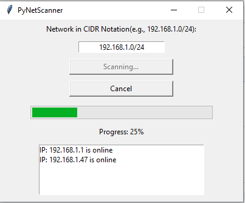

# PyNetScanner

A Python tkinter GUI to scan a private network for devices.

## Pre-requisites:
```
pip install pythonping
```

## Usage
Just double-click it to run without the cmd window in the background or alternatively invoke on the command line:
```
python PyNetScanner.pyw
```

## Screenshots
\

